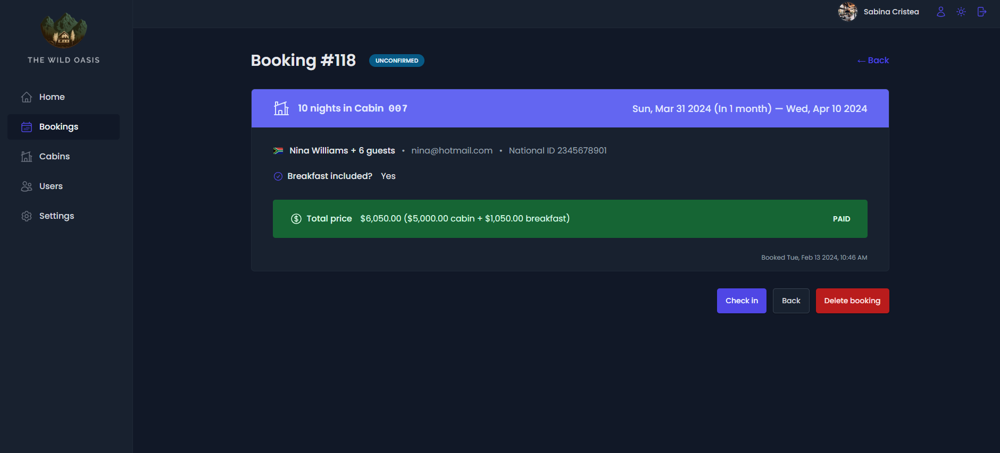

# The Wild Oasis - Hotel Management App - Jonas Schmedtmann's React Course

## App built using React, JavaScript & Vite

## Live Demo
Click [here](https://the-wild-oasis-hjqvem1lb-sabinas-projects-d8286ade.vercel.app/login) to see the live demo of the Wild Oasis.

## Brief
- Users of the app are hotel employees. They need to be logged into the application to perform tasks
- New users can only be signed up inside the applications (to guarantee that only actual hotel employees can get accounts)
- Users are able to upload an avatar, and change their name and password
- App has a table view with all cabins, showing the cabin photo, name, capacity, price, and current discount
- Users are able to update or delete a cabin, and to create new cabins (including uploading a photo)
- App has a table view with all bookings, showing arrival and departure dates, status, and paid amount, as well as cabin and guest data
- The booking status can be “unconfirmed” (booked but not yet checked in), “checked in”, or “checked out”.
- The table is filterable by this important status
- Other booking data includes: number of guests, number of nights, guest observations, whether they booked breakfast, breakfast price
- Users are able to delete, check in, or check out a booking as the guest arrives
- Bookings may not have been paid yet on guest arrival. Therefore, on check in, users need to accept payment (outside the app), and then confirm that payment has been received (inside the app)
- On check in, the guest has the ability to add breakfast for the entire stay, if they hadn’t already
- Guest data contains: full name, email, national ID, nationality, and a country flag for easy identification
- The initial app screen is a dashboard, to display important information for the last 7, 30, or 90 days:
-   A list of guests checking in and out on the current day. Users are able to perform these tasks from here
-   Statistics on recent bookings, sales, check ins, and occupancy rate
-   A chart showing all daily hotel sales, showing both “total” sales and “extras” sales (only breakfast at the moment)
-   A chart showing statistics on stay durations, as this is an important metric for the hotel
- Users are able to define a few application-wide settings: breakfast price, min and max nights/booking, max guests/booking
- App has a dark mode

## Technologies Used
- React
- JavaScript
- Vite
- styled-components
- React-router
- Context API
- React-query
- Recharts
- React hook form
- Supabase

## Screenshots

## License
This project is licensed under [Jonas Schmedtmann](https://github.com/jonasschmedtmann?tab=overview&from=2024-02-01&to=2024-02-20).

## Contact
For any questions or inquiries, please feel free to reach out to me at sabinacristea997@gmail.com.
